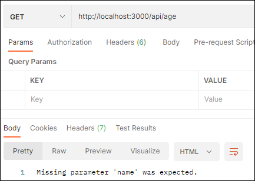

# Week 10
---
## 🔴 Monday
### 1) Forrest Gump Ping-Pong API 🏓
``` js
app.post('/api/buba-gump',function (req, res) {
    console.log("--" + req.message);
    let body = req.body;
    
    let msg = body.message;
    if (msg == "pong"){
        res.send("ping");
    }else if (msg == "ping"){
        res.send("pong");
    }else{
        res.send("PING PONG API 🏓🏓");
    }
});
```


### 2) Delayed Response API ⏳

``` js
app.get('/api/delay/:time?',function (req, res) {
    var time = req.params.time;
    if (time == undefined) time = 1000; 
    setTimeout(function() {
        res.send('Welcome! 🎉🎉🎉\n');
    }, time);
});
```


### 3) Age Prediction API 👶-👴

``` js
app.get('/api/age/:name?',function (req, res) {
    var n = req.params.name;
    let e = Math.floor( Math.random() * (99 - 1 ) + 1);
    let d = e * 365; 

    let respuesta = {
        nombre: n,
        edad: e,
        días: d
    };

    if(n == undefined){
        res.send("Missing parameter 'name' was expected.");
    }else{
        res.send(respuesta);
    }
});
```





### 4) NSA Secrets Box API - Hacking Challenge 👨‍💻

## 🔴 Tuesday

---
